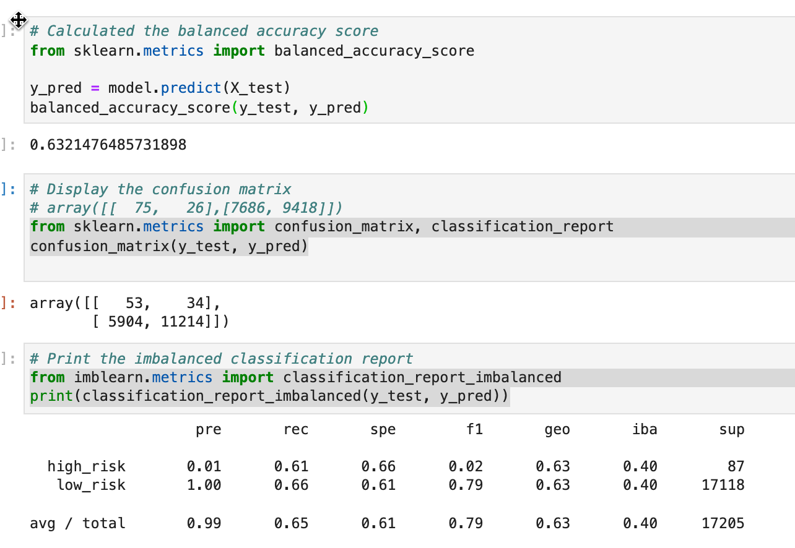
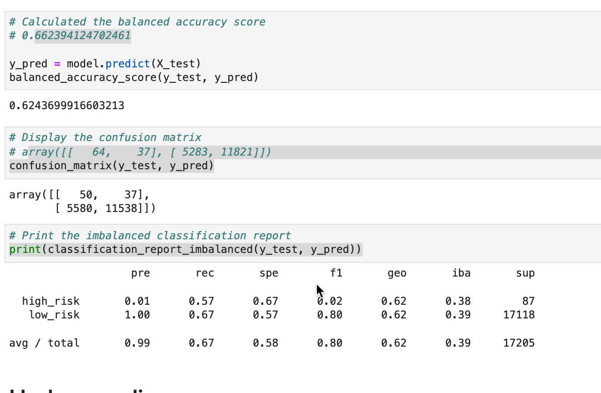
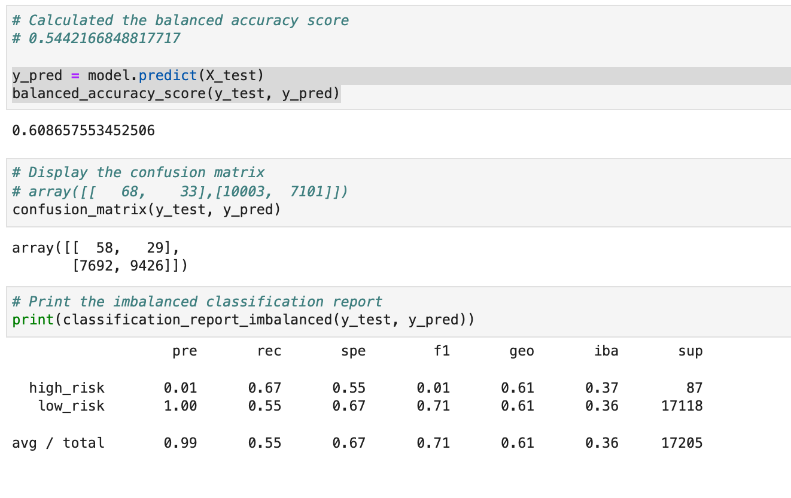
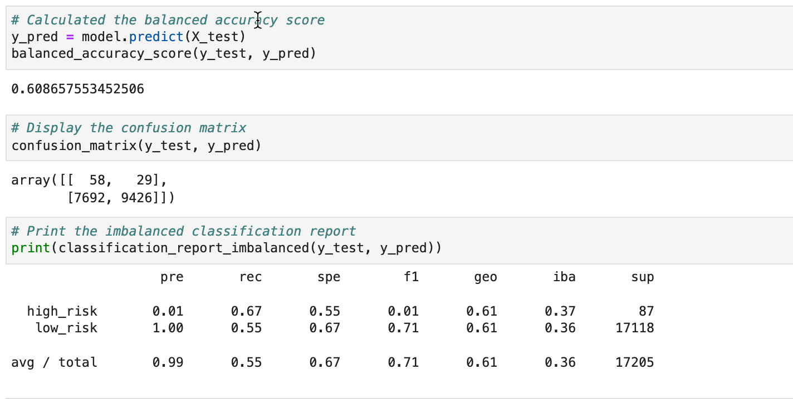
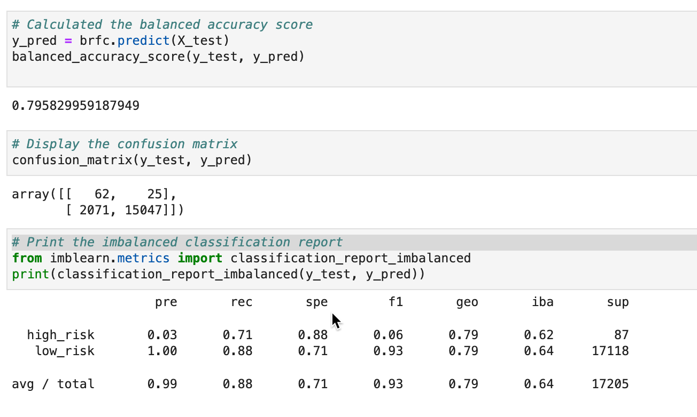
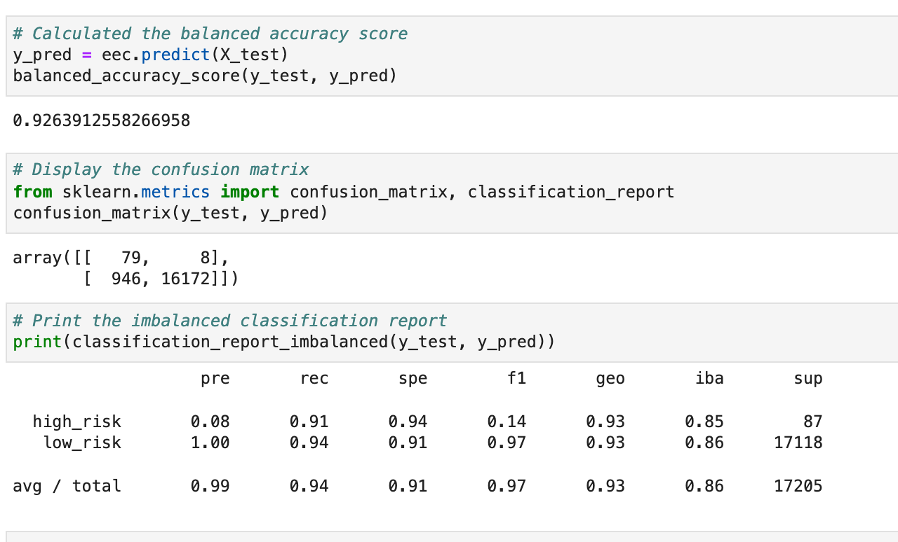

# Credit_Risk_Analysis

## Overview
In this project I will use Python to build and evaluate machine learning models to predict credit risk. 

### Purpose:
Using the credit card credit dataset from LendingClub, a peer-to-peer lending services company, this project will evaluate the performance of these models and make a written recommendation on whether they should be used to predict credit risk.

## Results
- ### RandomOverSampler model

- ### SMOTE model

- ### ClusterCentroids model

- ### SMOTEENN model

- ### BalancedRandomForestClassifier model

- ### EasyEnsembleClassifier model

## Summary

### Ranking of models in descending order based on accuracy results:

- EasyEnsembleClassifer: 92.6% accuracy, 8% precision, 91% recall, and 14% F1 Score

- BalancedRandomForestClassifer: 79.6% accuracy, 3% precision, 71% recall and 6% F1 Score

- RandomOverSampler: 63.2% accuracy, 1% precision, 61% recall and 2% F1 Score

- SMOTE: 62.4% accuracy, 1% precision, 57% recall and 2% F1 Score

- SMOTEENN: 60.9% accuracy, 1% precision, 67% recall and 1% F1 Score

- ClusterCentroids: 60.8% accuracy, 1% precision, 67% recall and 1% F1 Score

In reviewing all the models, the EasyEnsembleClassifer model yielded the best results with an accuracy rate of 92.6% and a 8% precision rate. I would think this would be a good model to use. 

